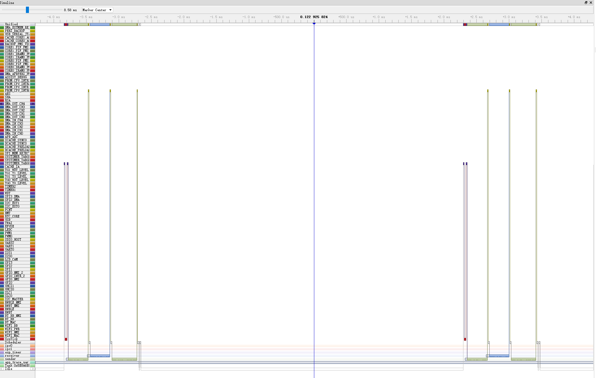

# Queue Trigger Task Yield

When a task sends a message to a queue, and if a higher priority task is waiting for the queue, the lower priority task will yield to the higher priority task before the send function returns.

# Example Logs

```
I (447) TASK2: Receiver task
I (447) TASK1: Sending task
I (447) TASK1: Sending = 1
W (447) TASK2: Received = 1
I (447) TASK1: Sent = 1 Done 

I (447) main_task: Returned from app_main()
I (457) TASK1: Sending = 2
W (457) TASK2: Received = 2
I (457) TASK1: Sent = 2 Done 

I (477) TASK1: Sending = 3
W (477) TASK2: Received = 3
I (477) TASK1: Sent = 3 Done 

I (487) TASK1: Sending = 4
W (487) TASK2: Received = 4
I (487) TASK1: Sent = 4 Done 

I (497) TASK1: Sending = 5
W (497) TASK2: Received = 5
I (497) TASK1: Sent = 5 Done 

I (507) TASK1: Sending = 6
W (507) TASK2: Received = 6
I (507) TASK1: Sent = 6 Done 

I (517) TASK1: Sending = 7
W (517) TASK2: Received = 7
I (517) TASK1: Sent = 7 Done 

I (527) TASK1: Sending = 8
W (527) TASK2: Received = 8
I (527) TASK1: Sent = 8 Done 

I (537) TASK1: Sending = 9
W (537) TASK2: Received = 9
I (537) TASK1: Sent = 9 Done 

I (547) TASK1: Sending = 10
W (547) TASK2: Received = 10
I (547) TASK1: Sent = 10 Done 
```

## Systemview

UART Config:
* 
* (12) UART TX on GPIO#
* (13) UART RX on GPIO#
* (1000000) UART baud rate



* The higher priority task did preempt the lower task when the queue had a message.
* But why the system tick interrupt is about 6ms? it should be 10ms.